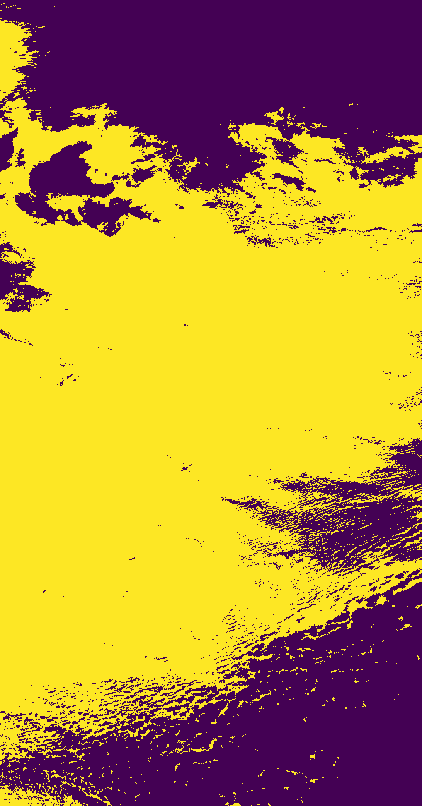
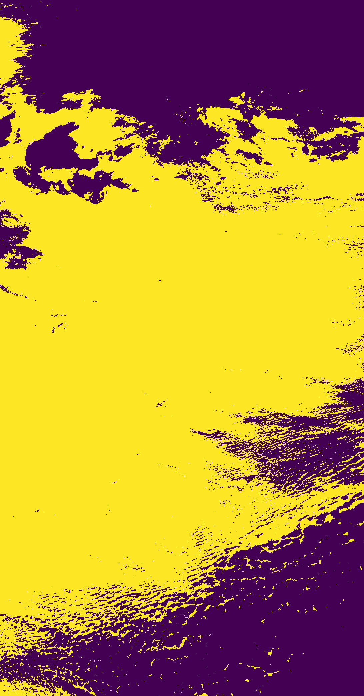

## Introduction

For this finall project, the aim is to explore the Sentinel-3 that understanding the classfication of clouds and ocean,by using artificial intelligence (AI) and IRIS techologies. This study will evaluate the benifits and limitations in Earth surface observation through comparing the differences in classification images produced by 4 kinds of models, such as CNN, Kmeans, VIT, RF.

Alos, here is a short video help you quickly understanding. link: https://www.youtube.com/watch?v=SYf3Wx9GW8w

## Review

What is Satellite, 

what general pricinples it use, 

21 bands ability information, and they are now widely use in the earth observation  

how widely use  


for classfication:  Diagram for cloud screening and snow classification (Sánchez-Zapero et al., 2023)


## Read data from Google Drive

The snippet is used in a Google Colab environment to interact with Google Drive. It starts by importing the drive module from google.colab and then mounts the user's Google Drive to the path /content/drive in the Colab environment, making the Drive's contents accessible. The os module is then imported to provide functions for interacting with the operating system.

```
from google.colab import drive
drive.mount('/content/drive')
import os
os.listdir('/content/drive/MyDrive/2030/datasets')
```

## Read netCDF4 .nc file and save to numpy file

The code loads and processes NetCDF files in a Google Colab environment. The function nc2npy loads a NetCDF file, extracts a specific variable, converts it to a NumPy array. 

```
data_path = '/content/drive/MyDrive/2030/datasets'
save_path = '/content/drive/MyDrive/2030/datasets'

# Load a single nc file and translate to npy
def nc2npy(path):
    nc = Dataset(path)
    nc = nc.variables[path.split('/')[-1].replace('.nc', '')]
    nc = np.array(nc)
    nc[np.where(nc == 65535)] = 0

    return nc

## Load and concatenate all nc files
res = []
for i in range(1,22):
    arr = nc2npy(os.path.join(data_path, "Oa%02d_radiance.nc"%(i)))
    res.append(arr)

res = np.stack(res, axis=-1)
print(res.shape)

# Save the result
np.save(os.path.join(save_path, "radiance.npy"), res)
```

## Load the preprocessed npy array and parse the annotations, then crop the original image into multiple 9x9 crops.

```
input_size = 9

def load_labels(mask_path, cfg_path):
    with open(cfg_path, 'r') as f:
        cfg = json.load(f)

    # Load colors from config
    mask_bbox = cfg['segmentation']['mask_area']
    class_info = cfg['classes'][1:]
    colors = [c['colour'][:3] for c in class_info]

    # Parse the color to classes
    mask = cv2.imread(mask_path, cv2.IMREAD_UNCHANGED)
    mask_labels = np.zeros(mask.shape[:2])
    for idx, c in enumerate(colors):
        mask_labels[(mask[:,:,0]==c[0]) & (mask[:,:,1]==c[1]) & (mask[:,:,2]==c[2])] = idx

    # Trim the mask to exclude boundary labels
    margin = input_size // 2
    trimmed_mask = mask_labels[margin:-margin, margin:-margin]

    # Flatten the trimmed mask to get a 1D array of labels
    labels = trimmed_mask.flatten()

    # Return bbox to crop images
    return labels, mask_bbox

# Load preprocessed features
bands = np.load(os.path.join(data_path, "radiance.npy"))

# Normalize the features
nx, ny = bands.shape[0] - 2, bands.shape[1] - 2
norm_mean = bands.reshape(-1, 21).mean()
norm_std = bands.reshape(-1, 21).std()
bands = (bands - norm_mean) / norm_std

# Load labels
labels, mask_bbox = load_labels(os.path.join(data_path, "mask1.png"),\
    os.path.join(data_path, "config1.json"))

# roi is with shape (1500, 1400, 21)
x1, y1, x2, y2 = mask_bbox
roi = bands[y1:y2, x1:x2]

# Extract patches of size 3x3 from the TOA BRF and reshape for further processing
patches = image.extract_patches_2d(roi, (input_size, input_size))

print(patches.shape)
print(labels.shape)
```

## Check the device

```
from tensorflow.python.client import device_lib
print(device_lib.list_local_devices())

os.environ["CUDA_VISIBLE_DEVICES"] = "1,2,3,4"
print('cuda available:',tf.test.is_built_with_cuda())
print("Num GPUs Available: ", len(tf.config.list_physical_devices('GPU')))
```
```
[name: "/device:CPU:0"
device_type: "CPU"
memory_limit: 268435456
locality {
}
incarnation: 15820196924703093999
xla_global_id: -1
, name: "/device:GPU:0"
device_type: "GPU"
memory_limit: 40427651072
locality {
  bus_id: 1
  links {
  }
}
incarnation: 11988428769573397337
physical_device_desc: "device: 0, name: NVIDIA A100-SXM4-40GB, pci bus id: 0000:00:04.0, compute capability: 8.0"
xla_global_id: 416903419
]
cuda available: True
Num GPUs Available:  1
```
## ViT Training

Difine a vision Transformer model for image classification and an experiment function for training. 

```
class Patches(layers.Layer):
    def __init__(self, patch_size):
        super(Patches, self).__init__()
        self.patch_size = patch_size

    def call(self, images):
        batch_size = tf.shape(images)[0]
        patches = tf.image.extract_patches(
            images=images,
            sizes=[1, self.patch_size, self.patch_size, 1],
            strides=[1, self.patch_size, self.patch_size, 1],
            rates=[1, 1, 1, 1],
            padding="VALID",
        )
        patch_dims = patches.shape[-1]
        patches = tf.reshape(patches, [batch_size, -1, patch_dims])
        return patches

class PatchEncoder(layers.Layer):
    def __init__(self, num_patches, projection_dim):
        super(PatchEncoder, self).__init__()
        self.num_patches = num_patches
        self.projection = layers.Dense(units=projection_dim)
        self.position_embedding = layers.Embedding(
            input_dim=num_patches, output_dim=projection_dim
        )

    def call(self, patch):
        positions = tf.range(start=0, limit=self.num_patches, delta=1)
        encoded = self.projection(patch) + self.position_embedding(positions)
        return encoded

def mlp(x, hidden_units, dropout_rate):
    for units in hidden_units:
        x = layers.Dense(units, activation=tf.nn.gelu)(x)
        x = layers.Dropout(dropout_rate)(x)
    return x

def create_vit_classifier(input_shape, patch_size, num_patches, projection_dim):
    inputs = layers.Input(shape=input_shape)
    # Augment data.
    augmented = more_data(inputs)
    # Create patches.
    patches = Patches(patch_size)(augmented)
    # Encode patches.
    encoded_patches = PatchEncoder(num_patches, projection_dim)(patches)

    # Create multiple layers of the Transformer block.
    for _ in range(transformer_layers):
        # Layer normalization 1.
        x1 = layers.LayerNormalization(epsilon=1e-6)(encoded_patches)
        # Create a multi-head attention layer.
        attention_output = layers.MultiHeadAttention(
            num_heads=num_heads, key_dim=projection_dim, dropout=0.1
        )(x1, x1)
        # Skip connection 1.
        x2 = layers.Add()([attention_output, encoded_patches])
        # Layer normalization 2.
        x3 = layers.LayerNormalization(epsilon=1e-6)(x2)
        # MLP.
        x3 = mlp(x3, hidden_units=transformer_units, dropout_rate=0.1)
        # Skip connection 2.
        encoded_patches = layers.Add()([x3, x2])

    # Create a [batch_size, projection_dim] tensor.
    representation = layers.LayerNormalization(epsilon=1e-6)(encoded_patches)
    representation = layers.Flatten()(representation)
    representation = layers.Dropout(0.5)(representation)
    # Add MLP.
    features = mlp(representation, hidden_units=mlp_head_units, dropout_rate=0.5)
    # Classify outputs.
    logits = layers.Dense(num_classes)(features)
    # Create the Keras model.
    model = keras.Model(inputs=inputs, outputs=logits)
    return model

def run_experiment(model, batch_size, num_epochs, learning_rate, weight_decay):
    optimizer = tfa.optimizers.AdamW(
        learning_rate=learning_rate, weight_decay=weight_decay
    )

    model.compile(
        optimizer=optimizer,
        loss=keras.losses.SparseCategoricalCrossentropy(from_logits=True),
        metrics=[
            keras.metrics.SparseCategoricalAccuracy(name="accuracy"),
            keras.metrics.SparseTopKCategoricalAccuracy(5, name="top-5-accuracy"),
        ],
    )

    checkpoint_filepath = "/tmp/checkpoint"
    checkpoint_callback = keras.callbacks.ModelCheckpoint(
        checkpoint_filepath,
        monitor="val_accuracy",
        save_best_only=True,
        save_weights_only=True,
    )

    history = model.fit(
        x=X_train,
        y=y_train,
        batch_size=batch_size,
        epochs=num_epochs,
        validation_split=0.1,
        callbacks=[checkpoint_callback],
    )

    model.load_weights(checkpoint_filepath)
    _, accuracy, top_5_accuracy = model.evaluate(X_test, y_test)
    print(f"Test accuracy: {round(accuracy * 100, 2)}%")

    return history

# Data augmentation
more_data = keras.Sequential(
    [
        layers.Normalization(),
        layers.Resizing(input_size, input_size),
        layers.RandomFlip("horizontal"),
        layers.RandomRotation(factor=0.02),
        layers.RandomZoom(
            height_factor=0.2, width_factor=0.2
        ),
    ],
    name="more_data",
)
more_data.layers[0].adapt(X_train)
```

Training and saving the model. Delete object after everything is done.

```
num_classes = 2 # Can be changed to multi-classed classification
patch_size = 3
input_shape = (input_size, input_size, 21)
num_patches = (input_size // patch_size) ** 2
projection_dim = 64
num_heads = 4
transformer_units = [
    projection_dim * 2,
    projection_dim,
]
transformer_layers = 8
mlp_head_units = [2048, 1024]

batch_size = 64
num_epochs = 1
learning_rate = 0.001
weight_decay = 0.0001

# Here vit is your trained model after the training
vit = create_vit_classifier(input_shape, patch_size, num_patches, projection_dim)
history = run_experiment(vit, batch_size, num_epochs, learning_rate, weight_decay)

vit.save(data_path+"vit_model.tf")

tf.keras.backend.clear_session()
del vit
gc.collect()
```
## CNN

This code defines and trains a Convolutional Neural Network (CNN) for binary classification task, the input is an image of size input_size x input_size, 21 channels containing three convolutional layers (with number of output channels 32, 64, 64 respectively) and a pooling layer, and then classifies it through a fully connected layer, and finally trains the model for three rounds and saves it.

```
num_classes = 2 # Can be changed to multi-classed classification
input_shape = (input_size, input_size, 21)
output_dim = [32,64,64]
batch_size = 64
num_epochs = 3
learning_rate = 0.001
weight_decay = 0.0001


# Define the model
cnn = models.Sequential()
in_dim = input_shape[-1]
for out_dim in output_dim:
    cnn.add(layers.Conv2D(out_dim, (3, 3), activation='relu', input_shape=(input_size, input_size, in_dim), padding='SAME'))
    in_dim = out_dim

cnn.add(layers.MaxPooling2D((3, 3)))

# Add dense layers for classification
cnn.add(layers.Flatten())
cnn.add(layers.Dense(output_dim[-1], activation='relu'))
cnn.add(layers.Dense(num_classes, activation='softmax'))

history = run_experiment(cnn, batch_size, num_epochs, learning_rate, weight_decay)
cnn.save("cnn_model.tf")

tf.keras.backend.clear_session()
del cnn
gc.collect()
```

## Random Forest and Logistic Regression

Use scikit-learn to generate the trainer and joblib to serialize python objects to save the model.

```
# Initialise the model with n_estimators specifying the number of trees in the forest
rf = RandomForestClassifier(n_estimators=32, n_jobs=32, max_depth=16)

# We need to reshape the data in order to be compatible with Random Forest
X_reshaped = np.reshape(X_train, (X_train.shape[0], -1))

# Fit the model to your training data
rf.fit(X_reshaped, y_train)
joblib.dump(rf, "random_forest_model.tf")
```

```
# Initialise the model with n_estimators specifying the number of trees in the forest
lr = LogisticRegression(n_jobs=32)

# We need to reshape the data in order to be compatible with Random Forest
X_reshaped = np.reshape(X_train, (X_train.shape[0], -1))

# Fit the model to your training data
lr.fit(X_reshaped, y_train)
joblib.dump(lr, "linear_regression_model.tf")
```

## Evaluation

### Quantitative results
Infer the results in another area, evalute the metrics, and save the visualization results.
```
# Import all packages needed
import numpy as np
import cv2
import json
import gc
from matplotlib import pyplot as plt
from sklearn.feature_extraction import image


input_size = 9
data_path = '/content/drive/MyDrive/2030/datasets'

def load_labels(mask_path, cfg_path):
    with open(cfg_path, 'r') as f:
        cfg = json.load(f)

    # Load colors from config
    mask_bbox = cfg['segmentation']['mask_area']
    class_info = cfg['classes'][1:]
    colors = [c['colour'][:3] for c in class_info]

    # Parse the color to classes
    mask = cv2.imread(mask_path, cv2.IMREAD_UNCHANGED)
    mask_labels = np.zeros(mask.shape[:2])
    for idx, c in enumerate(colors):
        mask_labels[(mask[:,:,0]==c[0]) & (mask[:,:,1]==c[1]) & (mask[:,:,2]==c[2])] = idx

    # Trim the mask to exclude boundary labels
    margin = input_size // 2
    trimmed_mask = mask_labels[margin:-margin, margin:-margin]

    # Flatten the trimmed mask to get a 1D array of labels
    labels = trimmed_mask.flatten()

    # Return bbox to crop images
    return labels, mask_bbox
```
predict func
```
def predict_deep(checkpoint, x_test):
    # Make predictions on the roi
    model = tf.keras.models.load_model(checkpoint, compile=False)
    print("Running prediction...")
    y_logit = []
    max_number_samples = int(1e6)
    while len(x_test) > 0:
        y_logit.append(model.predict(x_test[:max_number_samples], batch_size=65535))
        x_test = x_test[max_number_samples:]

        tf.keras.backend.clear_session()
        gc.collect()

        # print(len(y_logit), x_test.shape)
    y_logit = np.concatenate(y_logit, 0)

    # y_logit = model.predict(x_test, batch_size=65535)
    del model
    gc.collect()
    print("Done.")

    y_pred = np.argmax(y_logit, axis=1)
    return y_pred

def predict_traditional(checkpoint, x_test):
    # Predict the classes of the test data
    model = joblib.load(checkpoint)
    x_test_reshaped = np.reshape(x_test, (x_test.shape[0], -1))
    y_pred = model.predict(x_test_reshaped)
    del model
    gc.collect()
    return y_pred
```
### Predict and Visualization
```
import joblib
from sklearn.metrics import classification_report
import tensorflow as tf
from tensorflow import keras
from tensorflow.keras import layers, models
import tensorflow_addons as tfa

labels_test, mask_bbox_test = load_labels(os.path.join(data_path, "mask2.png"),\
    os.path.join(data_path, "config2.json"))
labels_test = labels_test.astype(np.int8)
x1, y1, x2, y2 = mask_bbox_test


# Load preprocessed features
bands = np.load(os.path.join(data_path, "radiance.npy"))

# Normalize the features
nx, ny = bands.shape[0] - 2, bands.shape[1] - 2
norm_mean = bands.reshape(-1, 21).mean()
norm_std = bands.reshape(-1, 21).std()
bands = (bands - norm_mean) / norm_std
roi_test = bands[y1:y2, x1:x2]

# Extract patches of size 9x9 from the TOA BRF and reshape for further processing
x_test_mask2 = image.extract_patches_2d(roi_test, (input_size, input_size))
print(x_test_mask2.shape, labels_test.shape)

models = ["vit", "cnn", "random_forest", "linear_regression"]
for model in models:
    pred_fn = predict_deep if model in ["vit", "cnn"] else predict_traditional
    y_pred = pred_fn(model + '_model.tf', x_test_mask2)

    # Evaluation
    print("============ Results of %s ============"%model)
    print(classification_report(labels_test, y_pred, target_names=["Ocean", "Cloud"]))

    # Reshape it for display
    margin = input_size // 2
    y_pred = y_pred.reshape(y2 - y1 - 2*margin, x2 - x1 - 2*margin)

    # Save the predicted map
    plt.imsave('pred_mask2_%s.png'%model, (y_pred*255).astype(np.uint8))
    plt.cla()
    plt.imshow((y_pred*255).astype(np.uint8))
    plt.show()
```
```
/usr/local/lib/python3.10/dist-packages/tensorflow_addons/utils/tfa_eol_msg.py:23: UserWarning: 

TensorFlow Addons (TFA) has ended development and introduction of new features.
TFA has entered a minimal maintenance and release mode until a planned end of life in May 2024.
Please modify downstream libraries to take dependencies from other repositories in our TensorFlow community (e.g. Keras, Keras-CV, and Keras-NLP). 

For more information see: https://github.com/tensorflow/addons/issues/2807 

  warnings.warn(
(2273544, 9, 9, 21) (2273544,)
Running prediction...
16/16 [==============================] - 10s 409ms/step
16/16 [==============================] - 7s 411ms/step
5/5 [==============================] - 2s 349ms/step
Done.
============ Results of vit ============
              precision    recall  f1-score   support

       Ocean       1.00      0.87      0.93   1028382
       Cloud       0.91      1.00      0.95   1245162

    accuracy                           0.94   2273544
   macro avg       0.95      0.94      0.94   2273544
weighted avg       0.95      0.94      0.94   2273544
```
<p align="center">
  
  <br>
  <em>CNN Predict Result</em>
</p>

<p align="center">
  
  <br>
  <em>VIT Predict Result</em>
</p>

<p align="center">
  
  <br>
  <em>Random Forest Predict Result</em>
</p>

<p align="center">
  
  <br>
  <em>Linear_regression Predict Result</em>
</p>

## Explainable AI
implementation code
```
# from sklearn.ensemble import RandomForestClassifier
import pandas as pd
import numpy as np
import matplotlib.pyplot as plt
import joblib

import os

os.chdir('/content/drive/MyDrive/2030')

input_size = 9

forest = joblib.load("random_forest_model.tf")
importances = forest.feature_importances_
importances = importances.reshape(input_size**2,21).mean(0)
std = np.std([tree.feature_importances_.reshape(input_size**2,21).mean(0) for tree in forest.estimators_], axis=0)

feature_names = [f"feature {i}" for i in range(len(importances))]
forest_importances = pd.Series(importances, index=feature_names)

fig, ax = plt.subplots()
forest_importances.plot.bar(yerr=std, ax=ax)
ax.set_title("Feature importances using MDI")
ax.set_ylabel("Mean decrease in impurity")
fig.tight_layout()
```

<p align="center">
  
  <br>
  <em>Explainable AI Result</em>
</p>

## Average Sensitivity of Prediction to Each Band Across Ensemble
### code implementation
```
import numpy as np
import tensorflow as tf
import matplotlib.pyplot as plt
from tensorflow.keras import layers, models
import gc


data_path = '/content/drive/MyDrive/2030/datasets'

# Define the CNN model architecture as a function for reusability
def create_model(input_shape):
    output_dim = [32,64,64]
    cnn = models.Sequential()
    in_dim = input_shape[-1]
    for out_dim in output_dim:
        cnn.add(layers.Conv2D(out_dim, (3, 3), activation='relu', input_shape=(input_size, input_size, in_dim), padding='SAME'))
        in_dim = out_dim

    cnn.add(layers.MaxPooling2D((3, 3)))

    # Add dense layers for classification
    cnn.add(layers.Flatten())
    cnn.add(layers.Dense(output_dim[-1], activation='relu'))
    cnn.add(layers.Dense(2, activation='softmax'))

    return cnn

# Sensitivity analysis function remains the same
def sensitivity_analysis(model, input_image, class_idx):
    input_image_tensor = tf.convert_to_tensor(input_image, dtype=tf.float32)  # Convert to TensorFlow tensor
    with tf.GradientTape() as tape:
        tape.watch(input_image_tensor)
        predictions = model(input_image_tensor, training=False)
        class_output = predictions[:, class_idx]

    gradients = tape.gradient(class_output, input_image_tensor)
    band_sensitivity = tf.reduce_sum(tf.abs(gradients), axis=(1, 2))
    return band_sensitivity.numpy()


X_train = np.load(os.path.join(data_path, 'X_train_balanced.npy'))
X_test = np.load(os.path.join(data_path, 'X_test_balanced.npy'))
y_train = np.load(os.path.join(data_path, 'y_train_balanced.npy'))
y_test = np.load(os.path.join(data_path, 'y_test_balanced.npy'))

# Ensemble approach: Train multiple models and compute average sensitivity
num_models = 5  # Number of models in the ensemble
ensemble_sensitivities = []

for i in range(num_models):
    print("Testing sensitivity for model %d..."%i)
    # Create and compile a new model instance
    model = create_model(X_train.shape[1:])
    model.compile(optimizer='adam', loss='sparse_categorical_crossentropy', metrics=['accuracy'])

    # Fit the model
    model.fit(X_train, y_train, epochs=3, validation_split=0.1, batch_size=64)

    # Perform sensitivity analysis on a sample image for each model
    sample_image = X_test[:1]  # Use the first image in X_test as a sample
    predictions = model.predict(sample_image)
    class_idx = np.argmax(predictions[0])  # Class of interest

    band_sensitivity = sensitivity_analysis(model, sample_image, class_idx)
    ensemble_sensitivities.append(band_sensitivity)

    tf.keras.backend.clear_session()
    del model
    gc.collect()

# Average the sensitivity scores across all models
average_sensitivity = np.mean(ensemble_sensitivities, axis=0)

# Visualize the average sensitivity scores
plt.figure(figsize=(10, 6))
plt.bar(range(X_train.shape[3]), average_sensitivity[0])
plt.xlabel('Band Number')
plt.ylabel('Average Sensitivity Score')
plt.title('Average Sensitivity of Prediction to Each Band Across Ensemble')
plt.show()
```
<p align="center">
  
  <br>
  <em>Average Sensitivity of Prediction to Each Band Across Ensemble Result</em>
</p>
